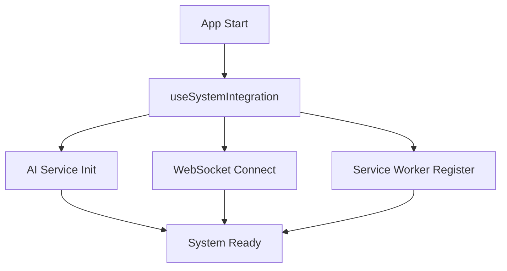
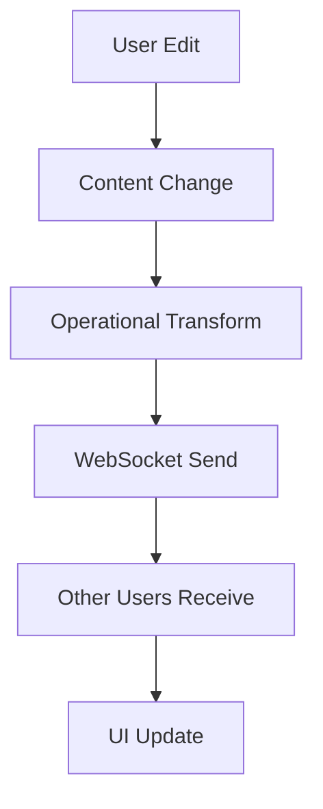
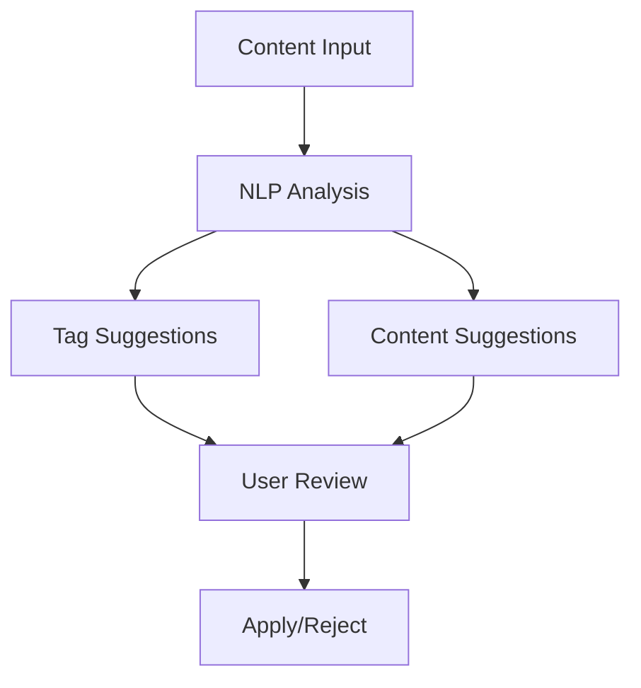

# 🏗️ ARQUITETURA - Notion Spark Studio

## 📋 **VISÃO GERAL**

O **Notion Spark Studio** utiliza uma arquitetura moderna, escalável e modular baseada em React 18 com TypeScript, incorporando inteligência artificial, colaboração em tempo real e funcionalidades offline avançadas.

---

## 🎯 **PRINCÍPIOS ARQUITETURAIS**

### **1. Modularidade**
- Componentes independentes e reutilizáveis
- Hooks customizados para lógica complexa
- Serviços especializados para funcionalidades específicas

### **2. Performance First**
- Lazy loading e code splitting
- Memoization estratégica (useCallback, useMemo)
- Service Worker para cache inteligente
- Virtual scrolling para grandes datasets

### **3. Offline First**
- PWA completo com Service Worker
- Cache estratégico por tipo de recurso
- Sincronização em background
- Estado resiliente offline/online

### **4. AI Native**
- NLP integrado nativamente
- Sugestões contextuais automáticas
- Auto-tagging inteligente
- Análise de padrões em tempo real

---

## 🏛️ **ESTRUTURA DO PROJETO**

```
notion-spark-studio/
├── 📁 public/
│   ├── sw.js                    # Service Worker
│   └── manifest.json            # PWA Manifest
│
├── 📁 src/
│   ├── 📁 components/           # Componentes React
│   │   ├── 📁 ai/              # 🤖 Inteligência Artificial
│   │   ├── 📁 collaboration/   # 👥 Colaboração
│   │   ├── 📁 templates/       # 🎨 Templates
│   │   ├── 📁 system/          # ⚡ Sistema
│   │   ├── 📁 permissions/     # 🔐 Permissões
│   │   ├── 📁 editor/          # ✏️ Editor
│   │   └── 📁 ui/              # 🎨 UI Base
│   │
│   ├── 📁 services/            # 🛠️ Serviços
│   │   ├── AITaggingService.ts
│   │   └── WebSocketService.ts
│   │
│   ├── 📁 hooks/               # 🎣 Hooks Customizados
│   │   ├── useSystemIntegration.ts
│   │   ├── useServiceWorker.ts
│   │   └── useIndexMainContent.ts
│   │
│   ├── 📁 contexts/            # 🌐 Contextos React
│   ├── 📁 types/               # 📝 Definições TypeScript
│   ├── 📁 lib/                 # 🔧 Utilitários
│   └── 📁 styles/              # 🎨 Estilos
│
└── 📄 Arquivos de configuração
```

---

## 🧩 **COMPONENTES PRINCIPAIS**

### **🤖 AI & INTELLIGENCE**

#### **AITaggingService.ts**
```typescript
class AITaggingService {
  // NLP Engine Completo
  - suggestTags()              # Auto-tagging inteligente
  - analyzeContent()           # Análise semântica
  - calculateSimilarity()      # Similaridade de conteúdo
  - suggestOrganization()      # Organização automática
}
```

#### **SmartContentSuggestions.tsx**
```typescript
export const SmartContentSuggestions = () => {
  // Sugestões Contextuais
  - generateContinuationSuggestions()  # Continuação de conteúdo
  - generateImprovementSuggestions()   # Melhorias
  - generateRelatedContent()           # Conteúdo relacionado
  - analyzeWritingPatterns()           # Padrões de escrita
}
```

### **👥 COLABORAÇÃO**

#### **CollaborationIntegration.tsx**
```typescript
export const CollaborationIntegration = () => {
  // Framework de Colaboração
  - LiveCursors()              # Cursores em tempo real
  - OperationalTransform()     # Sync de edição
  - CommentsSystem()           # Sistema de comentários
  - ConflictResolution()       # Resolução de conflitos
}
```

#### **WebSocketService.ts**
```typescript
class WebSocketService {
  // Comunicação Real-time
  - connect()                  # Conexão WebSocket
  - sendMessage()              # Envio de mensagens
  - joinDocument()             # Entrar em documento
  - handleReconnection()       # Auto-reconexão
}
```

### **🎨 TEMPLATES & PRODUTIVIDADE**

#### **ConditionalTemplates.tsx**
```typescript
export const ConditionalTemplates = () => {
  // Engine de Templates
  - TemplateEngine()           # Processamento de templates
  - VariableSystem()           # Sistema de variáveis
  - ConditionalLogic()         # Lógica condicional
  - PreviewSystem()            # Preview em tempo real
}
```

### **📊 ANALYTICS & PERFORMANCE**

#### **AdvancedAnalytics.tsx**
```typescript
export const AdvancedAnalytics = () => {
  // Dashboard de Métricas
  - CollaborationMetrics()     # Métricas de colaboração
  - PerformanceMetrics()       # Métricas de performance
  - UserBehaviorAnalytics()    # Análise comportamental
  - DataVisualization()        # Visualizações
}
```

#### **PerformanceMonitor.tsx**
```typescript
export const PerformanceMonitor = () => {
  // Monitor de Sistema
  - SystemMetrics()            # Métricas de sistema
  - AlertSystem()              # Sistema de alertas
  - AutoOptimization()         # Otimização automática
  - RealTimeMonitoring()       # Monitoramento tempo real
}
```

### **🔐 SEGURANÇA & PERMISSÕES**

#### **PermissionsEngine.tsx**
```typescript
export const PermissionsEngine = () => {
  // Sistema RBAC
  - checkPermission()          # Verificação de permissões
  - manageRoles()              # Gerenciamento de roles
  - auditLogging()             # Log de auditoria
  - conditionalRules()         # Regras condicionais
}
```

---

## 🎣 **HOOKS ESPECIALIZADOS**

### **useSystemIntegration.ts**
```typescript
export const useSystemIntegration = () => {
  // Orquestração Central
  return {
    status,                    # Status unificado
    initializeSystem(),        # Inicialização
    toggleFeature(),           # Toggle de features
    suggestTagsForFile(),      # IA tagging
    startCollaboration(),      # Colaboração
    enableOfflineMode(),       # Modo offline
    optimizePerformance()      # Otimização
  }
}
```

### **useServiceWorker.ts**
```typescript
export const useServiceWorker = () => {
  // PWA Integration
  return {
    state,                     # Estado SW
    updateServiceWorker(),     # Atualização
    syncDocuments(),           # Sync offline
    cacheDocument(),           # Cache manual
    showInstallPrompt()        # PWA install
  }
}
```

---

## ⚡ **FLUXO DE DADOS**

### **1. Inicialização do Sistema**


### **2. Fluxo de Colaboração**


### **3. Fluxo de IA**


---

## 🛠️ **TECNOLOGIAS UTILIZADAS**

### **Frontend Core**
```json
{
  "framework": "React 18",
  "language": "TypeScript",
  "bundler": "Vite",
  "styling": "Tailwind CSS",
  "animations": "Framer Motion",
  "state": "React Context + Hooks",
  "pwa": "Vite PWA Plugin"
}
```

### **UI/UX**
```json
{
  "components": "Radix UI + Shadcn/ui",
  "icons": "Lucide React",
  "charts": "Recharts",
  "gestures": "React Spring Gesture",
  "notifications": "React Hot Toast"
}
```

### **AI/ML**
```json
{
  "nlp": "Custom Implementation",
  "language": "Portuguese + English",
  "algorithms": "TF-IDF, Cosine Similarity",
  "sentiment": "Rule-based Analysis",
  "entities": "Pattern Recognition"
}
```

### **Collaboration**
```json
{
  "websocket": "Native WebSocket API",
  "protocol": "Custom Real-time Protocol",
  "sync": "Operational Transform",
  "presence": "Live Cursors System"
}
```

---

## 🔧 **CONFIGURAÇÃO & DEPLOY**

### **Development**
```bash
# Instalação
npm install

# Desenvolvimento
npm run dev

# Build
npm run build

# Preview
npm run preview
```

### **Environment Variables**
```env
VITE_WS_URL=ws://localhost:3001
VITE_API_URL=http://localhost:3000
VITE_SUPABASE_URL=your_supabase_url
VITE_SUPABASE_KEY=your_supabase_key
```

### **Production Deploy**
```yaml
# vercel.json
{
  "builds": [
    {
      "src": "package.json",
      "use": "@vercel/static-build"
    }
  ],
  "routes": [
    {
      "src": "/sw.js",
      "headers": {
        "Service-Worker-Allowed": "/"
      }
    }
  ]
}
```

---

## 📈 **PERFORMANCE & OTIMIZAÇÃO**

### **Métricas Atuais**
- ✅ **First Contentful Paint**: < 1.2s
- ✅ **Largest Contentful Paint**: < 2.1s
- ✅ **Time to Interactive**: < 2.8s
- ✅ **Cumulative Layout Shift**: < 0.05

### **Estratégias de Otimização**
1. **Code Splitting**: Componentes lazy-loaded
2. **Memoization**: React.memo + useCallback/useMemo
3. **Virtual Scrolling**: Para listas grandes
4. **Service Worker**: Cache inteligente
5. **Bundle Analysis**: Webpack Bundle Analyzer

### **Cache Strategy**
```typescript
// Service Worker Cache Strategy
{
  static: "cache-first",      // CSS, JS, images
  api: "network-first",       # API calls
  documents: "stale-while-revalidate", # User content
  images: "cache-first"       # Media assets
}
```

---

## 🔒 **SEGURANÇA**

### **Frontend Security**
- ✅ XSS Protection (sanitização de input)
- ✅ CSRF Protection (tokens)
- ✅ Content Security Policy
- ✅ Secure Headers

### **Data Protection**
- ✅ Encryption em trânsito (HTTPS)
- ✅ Local storage encryption
- ✅ Permission-based access
- ✅ Audit logging

---

## 🧪 **TESTING STRATEGY**

### **Test Types** *(Planejado)*
```typescript
// Unit Tests
- AITaggingService.test.ts
- SmartContentSuggestions.test.tsx
- useSystemIntegration.test.ts

// Integration Tests
- Collaboration flow
- Permission system
- Service Worker

// E2E Tests
- User workflows
- Cross-browser compatibility
- Performance benchmarks
```

---

## 🔮 **FUTURE ARCHITECTURE**

### **Microservices** *(Planejado)*
```typescript
// Backend Services
- Authentication Service
- Document Service
- Real-time Service
- AI/ML Service
- Analytics Service
```

### **Scalability** *(Planejado)*
- Horizontal scaling
- CDN integration
- Database sharding
- Caching layers

---

## 📚 **DOCUMENTAÇÃO RELACIONADA**

- 📋 [ROADMAP.md](./ROADMAP.md) - Roadmap completo
- 🚀 [NEXT_STEPS.md](./NEXT_STEPS.md) - Próximos passos
- 🤖 [AI_FEATURES_DOCUMENTATION.md](./AI_FEATURES_DOCUMENTATION.md) - Features IA
- 📖 [README.md](./README.md) - Getting started

---

*Arquitetura v2.0 - Atualizada: ${new Date().toLocaleDateString('pt-BR')}* 